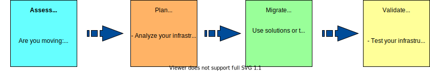

---

copyright:
  years:  2025
lastupdated: "2025-10-27"

keywords: migration, migrate, migrating, migrate infrastructure, cloud migration

subcollection: classic-to-vpc

---

{{site.data.keyword.attribute-definition-list}}

# About migration
{: #about-migration-infra}

Your drive to migrate might come from many factors such as modernization, cost reduction, consolidation, or data center closure. You might also migrate to be more cloud-native or adopt new technologies such as VPC. Regardless of the reason, migration can be as simple as migrating a single virtual server instance, or it can be as complex. For example, you might want to migrate your application to a more complex environment where you need to migrate an entire pod or data center with all of the underlying components.
{: shortdesc}

{: caption="Migration approach" caption-side="bottom"}

## Migration approach
{: #migration-approach}

| Step | Description |
|------|-------------|
|**Assess** | Do you need to migrate instances to a new data center due to data center closures? Do you want to migrate your entire {{site.data.keyword.cloud}} classic infrastructure to VPC? Assess your situation and identify your existing infrastructure to determine what components you have, how they are configured, and what you want to migrate. \n Not only do you need to assess your current environment, but you need to assess the target environment to understand the capabilities, support, and differences between the two environments, if applicable. In this assessment step, you can get a general idea of the complexity of the migration so that you can develop a migration strategy. |
|**Plan** | Analyze your current infrastructure and determine whether your resources and components can be migrated, and how much if any disruptions would that cause to your current business environment. Understanding how much time is needed to migrate and whether it needs to be done in stages can help you simplify the migration journey.|
|**Migrate** | After you assessed your existing infrastructure and planned for your migration, you can migrate your resources and components with ease and confidence. Depending on your migration needs, you can choose from tools that are available to help you with the migration process. |
|**Validate**  | After you migrate your resources and components into your target infrastructure, and before you make your infrastructure live, validate and test your environment to make sure it is ready for production. This activity might also entail updating your DNS and global load balancers, routes, or retiring old services. |

## Next Steps
{: #next-steps}

* Contact your IBM Cloud Customer Success Manager (CSM) or IBM Cloud Seller for planning, migration assistance and other queries.
* If you don’t have an IBM Cloud Customer Success Manager (CSM) or IBM Cloud Seller assigned, IBM will reach out to the primary contact in the account via e-mail

{: caption="Migration approach" caption-side="top"}
