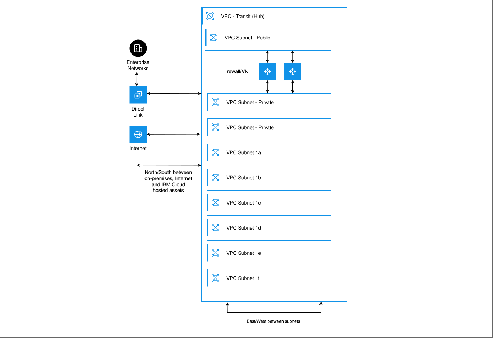
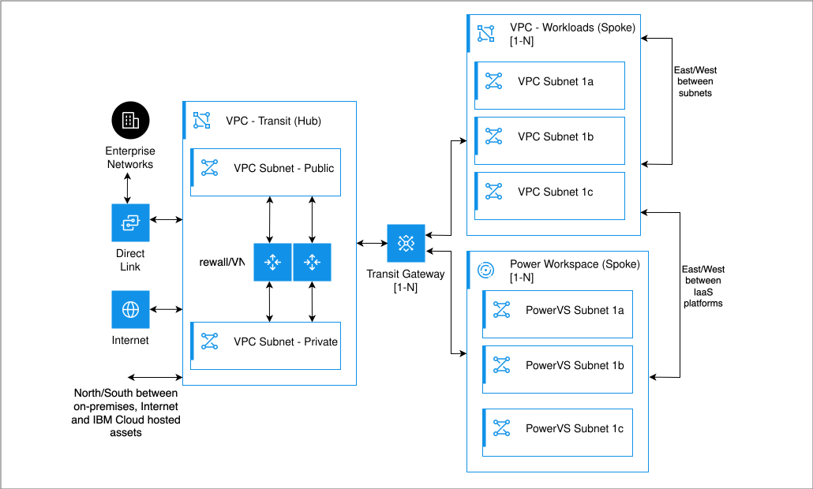

---

copyright:
  years: 2026
lastupdated: "2026-08-05"

keywords: vpc firewall, firewall deployment, high availability, fortinet,
  palo alto, juniper, check point, f5, transit vpc, sdn connector

subcollection: classic-to-vpc
---

{{site.data.keyword.attribute-definition-list}}


# IBM Cloud VPC firewall options
{: #vpc-firewall-options}

{{site.data.keyword.vpc_full}} supports multiple firewall deployment options, including stand-alone, Active/Passive, and Active/Active high-availability configurations that can be deployed within a single availability zone or across multiple availability zones.
{: shortdesc}

{{site.data.keyword.vpc_short}} is a Layer 3 Software-Defined Network (SDN) that provides flexible firewall deployment options to meet various security and availability requirements. Unlike {{site.data.keyword.cloud_notm}} Classic infrastructure, which uses a Layer 2 network architecture, VPC uses a Layer 3 SDN architecture that supports multiple firewall implementation patterns.

Before you select a deployment pattern, determine whether a dedicated firewall appliance is required for your workload.

## What firewall options to consider when you migrate
{: #firewall-migration-considerations}


### Do you need a firewall in VPC?
{: #do-you-need-firewall}

VPC includes built-in security features that might be sufficient for some workloads:

Security Groups (SGs)
:   Stateful firewalls that control traffic at the virtual server instance level. Security groups support allow rules only. When inbound traffic is allowed, return traffic is automatically allowed. Multiple security groups can be associated with a single instance. Security groups also support membership rules and references between security groups, which enable dynamic policy enforcement and simplified microsegmentation architectures.

Network Access Control Lists (NACLs)
:   Stateless firewalls that control traffic at the subnet level. NACLs support both allow and deny rules, and inbound and outbound rules must be explicitly defined. Rules are processed in sequence.

Public Gateway
:   Enables outbound internet access. Workloads are not reachable from the internet unless a floating IP or public load balancer is attached.

Transit Gateway
:   Provides connectivity across VPCs, accounts, and regions without requiring a dedicated routing appliance. Depending on your workload requirements, other security controls might still be required.

For more information about security groups and NACLs, see [Security in your VPC](/docs/vpc?topic=vpc-security-in-your-vpc).

#### IBM Cloud managed security services
{: #cloud-managed-security-services}

For specific security requirements, {{site.data.keyword.cloud_notm}} offers managed services that might eliminate the need for a dedicated firewall appliance:

* [{{site.data.keyword.cis_full}} (CIS)](https://www.ibm.com/products/cloud-internet-services){: external}: Provides Layer 7 (application layer) web application firewall (WAF), Distributed Denial of Service (DDoS) protection, global load balancing, and content delivery network (CDN) capabilities. If you need only application-layer protection, CIS can meet your requirements because it is a fully managed service and does not require deployment of a firewall appliance.
* [Virtual Private Network (VPN) for VPC and Client VPN services](https://www.ibm.com/products/vpn-for-vpc){: external}: It provides site-to-site and client-to-site VPN connectivity without requiring a firewall appliance.

#### When VPC native security might be sufficient
{: #when-vpc-native-security-sufficient}

VPC native security features might be sufficient in the following scenarios:

* Simple workload isolation requirements
* Basic ingress and egress traffic control at network and instance levels
* No advanced inspection or logging requirements
* Application-layer protection is handled by {{site.data.keyword.cis_short}}
* VPN connectivity is handled by VPC VPN service

### When to consider a dedicated firewall
{: #when-to-consider-dedicated-firewall}

Many enterprise and regulated workloads require capabilities beyond the native security features available in VPC. The following sections describe common requirements and considerations that can influence the decision to deploy a dedicated firewall.

These items are not a checklist. The presence of one or more requirements does not automatically indicate the need for a firewall appliance. Consider these factors alongside VPC native security features and managed services when you determine whether more controls are required.

#### Compliance and regulatory requirements
{: #compliance-requirements}

Some compliance frameworks and regulatory standards require security capabilities that extend beyond VPC native security controls.

PCI DSS, HIPAA, SOC 2
:   Many compliance frameworks mandate next-generation firewall (NGFW) capabilities.

Audit logging
:   Detailed traffic logs for integration with security information and event management (SIEM) systems such as IBM QRadar&reg;. VPC provides native logging capabilities, including [flow logs](/docs/vpc?topic=vpc-flow-logs) for network-level visibility and [data path logging for application load balancers](/docs/vpc?topic=vpc-datapath-logging). These services can support audit and monitoring requirements, depending on the level of detail and retention that is required.

Periodic security reports
:   Financial institutions and regulated industries often require comprehensive security reports every six to 12 months.

Simple Network Management Protocol (SNMP) traps and alerting
:   Integration with on-premises monitoring systems for real-time security event notification.

#### Advanced security capabilities
{: #advanced-security-capabilities}

A dedicated firewall can provide advanced traffic inspection, threat detection, and policy enforcement capabilities that extend beyond VPC native security features.

Intrusion Prevention System (IPS)
:   Deep packet inspection to detect and block malicious traffic patterns.

Intrusion Detection System (IDS)
:   Monitors and alerts on suspicious network activity.

Application-layer inspection
:   Inspect traffic beyond Layer 4 (ports and protocols).

Layer 7 proxy and reverse proxy capabilities
:   Advanced firewall and proxy solutions can provide Hypertext Transfer Protocol (HTTP) and HTTP Secure (HTTPS) proxying, Transport Layer Security (TLS) termination, and deep application awareness.

Application Load Balancer (ALB) integration
:   ALBs can complement firewall deployments by providing Layer 7 traffic distribution and TLS termination before or alongside inspection architectures.

Server Name Indication (SNI) routing
:   Support hostname-based routing and inspection policies for HTTPS applications.

Egress SNI filtering
:   Some vendor solutions support outbound HTTPS filtering based on SNI values, enabling policy enforcement for outbound internet access without full TLS decryption.

Command-and-control (C2) blocking
:   Automatically block connections to known malicious servers.

Data loss prevention (DLP)
:   Inspect and control sensitive data that exits your network.

URL filtering
:   Control access to websites by category or specific URLs.

Quality of service (QoS)
:   Prioritize critical application traffic.

#### Operational requirements
{: #operational-requirements}

Organizations with centralized security and governance requirements might benefit from deploying a dedicated firewall.

Centralized security policy management
:   Manage security rules across multiple VPCs from a single point.

Multi-tenant isolation
:   Separate security zones for different applications or customers.

Advanced logging and forensics
:   Detailed traffic logs with source and destination IP, ports, and application identification.

Automation capabilities
:   Enable application programming interface (API)-driven security policy updates and threat response.

Disaster recovery
:   Support Active/Passive or Active/Active high availability across zones or regions.

#### Network architecture requirements
{: #network-architecture-requirements}

Certain network architectures require traffic inspection, segmentation, or routing patterns that are best implemented with a dedicated firewall.

Transit VPC (hub and spoke)
:   A centralized connectivity pattern for traffic between multiple VPCs. For more information, see [Transit VPC hub-and-spoke architecture](/docs/pattern-transit-vpc?topic=pattern-transit-vpc-transit-vpc). This pattern can also serve as a centralized security inspection point when advanced controls are required.

Custom routing and traffic engineering
:   {{site.data.keyword.vpc_short}} supports custom routing tables and user-defined routes, enabling advanced traffic-steering patterns that are similar to {{site.data.keyword.cloud_notm}} Classic Gateway Appliance deployments, including Vyatta&reg;/Virtual Router Appliance (VRA), Juniper&reg; vSRX, and Fortinet&reg; vFSA solutions. Custom routes can direct traffic through firewalls, inspection points, transit gateways, or other network virtual appliances. This approach supports centralized security and segmented network architectures.

Hybrid cloud connectivity
:   Secure connections between VPC and on-premises data centers.

First-hop security
:   Stop and inspect all ingress and egress traffic at a single security checkpoint.

Zone-based security
:   Create security zones, such as DMZ, application tier, database tier, with controlled traffic flows between zones.

Cross-region connectivity and routing architecture
:   {{site.data.keyword.vpc_short}} uses a Layer 3 SDN model in which cross-region and cross-account connectivity is implemented by using the {{site.data.keyword.cloud_notm}} Transit Gateway service and VPN gateways, rather than firewall-centric routing. The {{site.data.keyword.cloud_notm}} Transit Gateway provides the primary routing fabric between VPCs, while VPN gateways end encrypted Internet Protocol Security (IPsec) tunnels from on-premises or data center environments. In cross-region deployments, Transit Gateway instances are deployed in each region and connected through Transit Gateway peering to enable controlled inter-region routing without requiring firewall-based transit. This model replaces Classic infrastructure patterns where gateway firewalls were commonly used as centralized routing and connectivity hubs across data centers, accounts, or regions. For more information, see [Transit VPC hub-and-spoke architecture](/docs/pattern-transit-vpc?topic=pattern-transit-vpc-transit-vpc).

### Classic infrastructure firewall context
{: #classic-firewall-context}

In {{site.data.keyword.cloud_notm}} Classic infrastructure, firewalls serve a critical role due to the Layer 2 network architecture:

VLAN separation
:   Classic infrastructure uses VLANs to separate traffic. Transit VLANs connect gateways to public and private networks.

Gateway routing
:   Resources are associated with VLANs that route traffic through gateway appliances (such as vFSA) for protection.

Untagged service networks
:   Transit VLANs act as service networks where packets are untagged.

Tagged workload networks
:   Automatic and Premium VLANs carry tagged traffic with subnets and IPs for workloads.

#### Key difference in VPC
{: #key-difference-vpc}

VPC uses a Layer 3 SDN architecture and the vendor-provided SDN Connector to provide more flexible security options. However, the advanced security capabilities that firewalls provide remain essential for many enterprise workloads.

Unlike Classic infrastructure, which relies on VLAN-based routing through gateway appliances such as VRA (Vyatta), VPC uses routing tables, custom routes, and transit architectures to steer traffic through security and inspection services.

### Decision framework
{: #firewall-decision-framework}

Use the following framework to determine your firewall requirements:

1. Document your compliance, security, and operational requirements.
1. Determine whether security groups, NACLs, and public gateways meet your requirements.
1. Consider {{site.data.keyword.cloud_notm}} managed services:
   - For application-layer (Layer 7) protection only: Use [{{site.data.keyword.cis_short}}](https://www.ibm.com/products/cloud-internet-services){: external}
   - For VPN connectivity: Use [VPC VPN service](https://www.ibm.com/products/vpn-for-vpc){: external}
1. List capabilities that VPC native security and managed services cannot provide.
1. If a network firewall appliance is required, choose the appropriate [deployment pattern](#deployment-options) based on availability and performance requirements.

   Before you select a firewall vendor, review the [vendor support matrix for high availability (HA) firewall deployments](#vendor-support-matrix-firewall-deployment-licensing).

   Vendor support varies by deployment mechanism, including Network Load Balancer (NLB), Border Gateway Protocol (BGP) over Generic Routing Encapsulation (GRE), SDN Connector-based failover, or bare metal virtualization. Not all vendors support all deployment patterns, and custom images and vendor-specific licensing configurations require validation.

Each firewall deployment pattern is described with its characteristics, available solutions, and implementation options.

## Firewall offering types
{: #firewall-offering-types}

Firewall solutions in {{site.data.keyword.vpc_short}} are available through three primary offering models. Understanding these models can help you evaluate vendor support, deployment options, licensing responsibilities, and support boundaries.

### BYOA (Bring Your Own Appliance)
{: #byoa}

BYOA deployments use customer-managed custom images instead of {{site.data.keyword.cloud_notm}} catalog offerings. Customers are responsible for obtaining and maintaining appliance licenses, software updates, and vendor support entitlements.

The following characteristics apply to BYOA deployments:

* Customers can deploy firewall vendors, software versions, and configurations that are not available through the {{site.data.keyword.cloud_notm}} catalog.
* Customers are responsible for validating high-availability configurations, automation workflows, routing integration, and vendor support.

For more information, see [Custom images, BYOA, and vendor support](#custom-images-byoa-vendor-support), and related deployment patterns, such as [Stand-alone deployments](#standalone-deployment) and [Active/Passive HA models](#active-passive-single-zone).

### BYOL catalog offering
{: #byol-catalog-offering}

Bring Your Own License (BYOL) catalog offerings are vendor-provided firewall images that are available through the {{site.data.keyword.cloud_notm}} catalog. Customers deploy from an approved catalog tile, but provide their own firewall license directly from the vendor.

The following characteristics apply to BYOL catalog offerings:

* Vendor-provided images are available through the {{site.data.keyword.cloud_notm}} catalog.
* Customers obtain and manage firewall licenses directly from the vendor.
* Offerings often include vendor-tested deployment automation and reference architectures.
* Vendor support is governed by the vendor's licensing and support terms.

Examples include Fortinet, Juniper, Check Point&reg;, and other firewall offerings that are available through the {{site.data.keyword.cloud_notm}} catalog.

For more information, see [Licensing models](#licensing-models) and applicable deployment patterns, such as [Active/Active HA (Single Zone)](#active-active-single-zone) and [Active/Passive HA (Multizone)](#active-passive-multizone), which commonly use BYOL-based images.

### PayGo (IBM licensed firewall offering)
{: #paygo}

PayGo offerings are IBM licensed firewall solutions that are purchased directly through {{site.data.keyword.cloud_notm}}. Licensing costs are included with the offering and are billed through {{site.data.keyword.cloud_notm}}.

These offerings simplify procurement, billing, and lifecycle management by eliminating the need for customers to separately purchase and manage firewall licenses.

For more information, see [Licensing models](#licensing-models), and related deployment considerations in [Active/Passive HA (Single Zone)](#active-passive-single-zone) and [Deployment options overview](#deployment-options), where PayGo models might reduce operational complexity in supported configurations.

## Comparison of firewall deployment options
{: #firewall-deployment-option-comparison}

The following table summarizes the most common firewall deployment options in VPC. Active/Passive deployments are the recommended pattern for enterprise workloads, while Active/Active deployments that use NLBs or BGP over GRE are typically used for scalability, traffic distribution, and routing flexibility requirements.

In BGP over GRE-based deployments, overall throughput depends on the firewall appliance architecture and GRE processing efficiency. In some implementations, GRE encapsulation and routing can reach central processing unit (CPU) capacity limits and restrict horizontal scaling.

For detailed implementation guidance and reference architectures, see the [Transit VPC documentation](/docs/pattern-transit-vpc?topic=pattern-transit-vpc-transit-vpc) and associated deployment guides referenced throughout the topic.
{: tip}

| Feature | [Stand-alone](#standalone-deployment) | [Active/Active HA (Single Zone)](#active-active-single-zone) | [Active/Passive HA (Single Zone)](#active-passive-single-zone) | [Active/Passive HA (Multizone)](#active-passive-multizone) | [Active/Active HA (Multizone)](#active-active-multizone) |
| --------- | ------------------------------------- | --------------------------------------------- | ---------------------------------------------- | ---------------------------------------------- | --------------------------------------------- |
| **High availability/failover method** | N/A | [Route mode network load balancer (RMNLB)](#route-mode-nlb-technical-details) or BGP over GRE | Virtual server instance: [SDN Connector](#sdn-connector-overview)[^sdn] \n Bare metal server: [Virtual network floating interface](#bare-metal-servers-reference) | [SDN Connector](#sdn-connector-overview) | BGP over GRE or per-zone [RMNLB](#route-mode-nlb-technical-details) with optional state synchronization for asymmetric routing scenarios |
| **Deployment complexity** | Low | Medium | Medium | High | High |
| **Compute options** | Virtual server instance or [bare metal server](#bare-metal-servers-reference) | Virtual server instance | Virtual server instance or [bare metal server](#bare-metal-servers-reference) | Virtual server instance | Virtual server instance |
| **Performance** | [See performance factors](#performance-factors) | [See performance factors](#performance-factors) | [See performance factors](#performance-factors) | [See performance factors](#performance-factors) | [See performance factors](#performance-factors) |
| **Public ingress support** | Yes | RMNLB with public address range | Limited: Fortinet native only and BYOA with bare metal | Limited: Fortinet native only | None |
| **Supported vendors** | BYOA/BYOL | BYOA / BYOL using [RMNLB](#route-mode-nlb-technical-details) \n BGP-capable vendors that use BGP over GRE | Fortinet native, BYOA with [bare metal](#bare-metal-servers-reference) | Fortinet native | BYOA / BYOL using BGP over GRE |
| **BYOA / Vendor support qualification**[^cv] | Customer validation required | Customer validation required | Customer validation required | Customer validation required | Customer validation required |
| **Use case** | Dev/Test, small workloads | High throughput through scaling | Production (zone-level resilience) | Production (regional resilience) | High throughput + regional resilience |
| **Licensing** | BYOL | BYOL | BYOL | BYOL | BYOL |
{: caption="Comparison of firewall deployment patterns" caption-side="bottom"}

[^sdn]: Virtual Router Redundancy Protocol (VRRP), Pacemaker, or vendor-specific HA mechanisms might be supported depending on vendor and design.

[^cv]: Custom or BYOA vendor images might require customer-managed integration and validation. Vendor image availability does not necessarily imply {{site.data.keyword.vpc_short}} compatibility or vendor-supported operation. For more information, see [Custom images and vendor support](#custom-images-byoa-vendor-support).

After you identify a deployment pattern, review the [vendor support matrix for HA firewall deployments](#vendor-support-matrix-firewall-deployment-licensing) to determine which firewall vendors support the selected high availability architecture, routing model, and automation mechanism.

Public ingress support refers to whether a deployment pattern provides native handling of inbound internet traffic and associated failover behavior for public endpoints.

Some patterns, such as Active/Active designs that use RMNLB or BGP over GRE, provide traffic forwarding or routing control but do not inherently provide ingress failover for public IP endpoints. In these cases, a separate ingress design is required. This design might include route-mode load balancing, public address range routing, or vendor-specific automation, such as SDN Connector integration for supported firewall appliances.

Bare metal-based deployments might also implement advanced ingress and failover behavior by using customer-managed virtualization layers. For example, Kernel-based Virtual Machine (KVM)/Quick Emulator (QEMU)-based virtualization, {{site.data.keyword.redhat_openshift_notm}} Virtualization, or VM mobility patterns similar to vMotion&reg;. In these architectures, instance-level mobility and failover behavior are managed by the customer-managed platform rather than by the VPC networking layer.

Bring Your Own Appliance (BYOA) deployments enable consistent Active/Passive designs across multiple vendors by enabling customer-controlled automation for failover and ingress handling. When combined with SDN Connector integration or custom automation, BYOA deployments can support standardized public ingress patterns for firewall appliances across both virtual server instance and bare metal deployments.

All deployment patterns that are described in this table can be implemented within a single VPC. “Single VPC” is a deployment context rather than a separate firewall architecture, and is therefore covered by each option, that is depending on availability, scale, and routing requirements.

### Public ingress support considerations
{: #public-ingress-support}

Public ingress traffic can be directed to firewall instances by using {{site.data.keyword.vpc_short}} public ingress capabilities and routing constructs.

The following considerations can help you evaluate public ingress support for different deployment models:

* Active/Passive deployments: Public ingress can be associated with public address ranges or floating IPs. VPC routing tables can then direct traffic to the active firewall instance for inspection and forwarding.
* Active/Active deployments with RMNLBs: Public ingress can be associated with public address ranges or other supported ingress constructs and routed to an RMNLB. The RMNLB then distributes traffic across available firewall instances for inspection.
* Bare metal deployments: Public ingress can be directed to firewall instances by using the same VPC routing capabilities, with implementation details, that are depending on the deployment architecture.
* Other firewall vendors and custom images: Public ingress routing follows the standard {{site.data.keyword.vpc_short}} routing model. Customers must validate vendor-specific deployment and routing requirements.

For more information, see [About routing tables and routes](/docs/vpc?topic=vpc-about-custom-routes#routes-ingress).

## Vendor support matrix for HA firewall deployments in IBM Cloud VPC
{: #vendor-support-matrix-firewall-deployment-licensing}

Vendor support for high availability (HA) firewall deployment patterns in {{site.data.keyword.vpc_short}} is summarized in the following table.

Vendor support varies by HA deployment pattern, automation requirements, routing model, and vendor-specific capabilities.

| Deployment topology | Fortinet | Juniper vSRX | Check Point | Palo Alto&reg; | Other vendors (custom images) |
| ------------------- | -------- | ------------ | ----------- | --------- | ----------------------------- |
| Active/Passive[^ap] | Supported \n (BYOL; native SDN Connector integration; PayGo – Roadmap) | BYOA | BYOA | BYOA | BYOA |
| Active/Passive bare metal deployment[^bmd] | BYOA | BYOA | BYOA | BYOA | BYOA |
| Active/Active (HA – RMNLB) | Supported (BYOL; PayGo – Roadmap) | Supported (BYOL; PayGo – Roadmap) | Supported (BYOL) | BYOA | BYOA, if transparent routing is compatible |
| Active/Active (HA – BGP over GRE) | Supported (BYOL; PayGo – Roadmap) | Supported (BYOL; PayGo – Roadmap) | Supported (BYOL, if BGP-capable) | BYOA, if BGP-capable | BYOA, if BGP and GRE are capable |
{: caption="Vendor support matrix for HA firewall deployments in {{site.data.keyword.vpc_short}}" caption-side="bottom"}

[^ap]: Active/Passive deployments include both single-zone and cross-zone (multizone) configurations. Fortinet provides native SDN Connector integration for automated cross-zone failover, while other vendors require customer-managed automation or HA mechanisms such as VRRP or Pacemaker.

[^bmd]: Bare metal deployment is a deployment platform rather than an HA architecture. HA behavior on bare metal depends on the selected clustering, failover, or virtualization technology (for example, virtual network floating interfaces, VRRP, Pacemaker, vendor-specific HA mechanisms, or customer-managed virtualization platforms).

Catalog image availability does not imply support for all deployment patterns. Vendor-specific automation, routing capabilities, and HA functions vary by vendor and deployment architecture.
{: note}

## Common deployment patterns
{: #common-deployment-patterns}

Firewall deployments in VPC use established network architecture patterns to control, inspect, and secure traffic flows.

### Transit VPC (hub and spoke)
{: #transit-vpc-pattern}

A Transit VPC (hub-and-spoke) architecture centralizes network security and traffic inspection. Firewall appliances are deployed in a dedicated transit VPC that serves as a hub for connectivity between enterprise networks, the internet, {{site.data.keyword.cloud_notm}} workloads, and other connected platforms.

Traffic between spoke VPCs, on-premises environments, and external networks can be routed through the transit VPC for inspection and policy enforcement. East-west traffic between connected environments can also be controlled through centralized routing and firewall policies.

This pattern provides centralized security controls, consistent policy enforcement, and simplified management for environments that contain multiple VPCs or hybrid-cloud connectivity requirements.

{: caption="Transit VPC hub-and-spoke deployment pattern" caption-side="bottom"}

For more information, see [Securing multiple landing zones with a transit VPC and advanced security capabilities](/docs/pattern-transit-vpc?topic=pattern-transit-vpc-transit-vpc).

### Single VPC
{: #single-vpc-pattern}

A single VPC architecture deploys firewall appliances directly within the same VPC as the protected workloads. Traffic flows are controlled through VPC routing tables and firewall policies within that VPC.

This pattern is suitable for isolated workloads, smaller environments, or deployments that do not require centralized inspection across multiple VPCs. It provides a simpler architecture with fewer networking components while still enabling north-south traffic inspection and workload segmentation.

For larger environments or deployments that require centralized security controls across multiple VPCs, a Transit VPC architecture is typically preferred.

{: caption="Single VPC deployment pattern" caption-side="bottom"}

## Deployment options
{: #deployment-options}

{{site.data.keyword.vpc_short}} supports multiple deployment options to address different availability and scalability requirements.

Vendor support differs by deployment topology and implementation model. Before you select a firewall vendor, review the [vendor support matrix for HA firewall deployments](#vendor-support-matrix-firewall-deployment-licensing).

For most enterprise production workloads, virtual server instance-based Active/Passive HA deployments are the recommended starting point for {{site.data.keyword.vpc_short}} firewall architectures.

This deployment model provides:

- High availability with lesser operational complexity
- Compatibility with vendor-supported automation patterns
- Flexible scaling and hourly billing
- Simplified routing compared to Active/Active BGP-based routing architectures
- Easier migration from {{site.data.keyword.cloud_notm}} Classic gateway deployments

More advanced architectures, such as Active/Active multizone deployments by using BGP over GRE, are typically selected for large-scale throughput, advanced traffic engineering, or specialized routing requirements.

### Stand-alone deployment
{: #standalone-deployment}

A stand-alone deployment consists of a single firewall instance without high availability. This deployment is suitable for development, testing, or noncritical workloads.

#### Characteristics
{: #standalone-characteristics}

- Simplest deployment model
- No automatic failover
- Lesser cost
- Any vendor supported

#### Available solutions
{: #standalone-available-solutions}

The following table outlines the available stand-alone firewall solutions from leading vendors, along with their corresponding products and catalog links. Vendor compatibility depends on the selected deployment mechanism and might require validation for BYOL and custom image deployments.

| Vendor | Product | Catalog link |
| -------- | --------- | -------------- |
| Fortinet | FortiGate&reg; Next-Generation Firewall - Single VM | [View Fortinet FortiGate Single VM in catalog](/catalog/content/ibm-fortigate-terraform-deploy-1f878ca9-069f-42ca-9ed9-5b461d4d5231-global){: external} |
| Juniper | Next-Gen SASE Firewall - BYOL | [View Juniper Next-Gen SASE Firewall in catalog](/catalog/content/jnpr-nextgen-fw-vsrx-74b4b3ba-2a05-460d-afba-98e4d012f53a-global?catalog_query=aHR0cHM6Ly9jbG91ZC5pYm0uY29tL2NhdGFsb2c%2Fc2VhcmNoPXZtLXNlcmllcyUyNTIwZmlyZXdhbGwlMjUyMGJ5b2wjc2VhcmNoX3Jlc3VsdHM%3D){: external} |
| Check Point | CloudGuard&reg; Network Security Firewall | [View Check Point CloudGuard in catalog](/catalog/content/check-point-cloudguard-network-security-firewall-with-threat-prevention-1f1f50fe-e41d-4715-9ba6-02d37d76596c-global?catalog_query=aHR0cHM6Ly9jbG91ZC5pYm0uY29tL2NhdGFsb2c%2Fc2VhcmNoPWNoZWNrJTI1MjBwb2ludCNzZWFyY2hfcmVzdWx0cw%3D%3D){: external} |
| F5&reg; | BIG-IP&reg; Virtual Edition for VPC | [View F5 BIG-IP Virtual Edition in catalog](/catalog/content/ibmcloud_schematics_bigip_multinic_declared-1.0-d33f1544-e938-478a-b0dd-d883370f08d0-global?catalog_query=aHR0cHM6Ly9jbG91ZC5pYm0uY29tL2NhdGFsb2c%2Fc2VhcmNoPUY1I3NlYXJjaF9yZXN1bHRz){: external} |
{: caption="Available stand-alone firewall solutions" caption-side="bottom"}

#### Best for
{: #standalone-best-for}

- Development and testing environments
- Noncritical workloads
- Cost-sensitive deployments
- Proof of concept projects

Stand-alone deployments do not provide firewall high availability. IBM does not suggest them for mission-critical production workloads.
{: note}

### Active/Active HA (single zone)
{: #active-active-single-zone}

Multiple firewall instances actively process traffic within a single availability zone by using either an RMNLB or BGP over GRE for dynamic routing.

#### Characteristics
{: #active-active-sz-characteristics}

* Load balancing across multiple firewall instances
* Scalable traffic distribution capacity
* Supports RMNLB or BGP over GRE
* Vendor support depends on the deployment mechanism
* Single-zone high availability

#### Available solutions
{: #active-active-sz-available-solutions}

The following table outlines the available Active/Active (Single Zone) firewall solutions from leading vendors, along with their corresponding products and catalog links. Vendor compatibility depends on the selected deployment mechanism (RMNLB or BGP over GRE) and requires validation for BYOL and custom image deployments.

| Vendor | Product | Catalog link |
| -------- | --------- | -------------- |
| Fortinet | FortiGate Next-Generation Firewall - A/A Single Zone | [View Fortinet FortiGate A/A Single Zone in catalog](/catalog/content/ibm-fortigate-terraform-deploy-1f878ca9-069f-42ca-9ed9-5b461d4d5231-global){: external} |
| Juniper | vSRX Firewall (BYOL) | [View Juniper vSRX Firewall in catalog](/catalog/content/jnpr-nextgen-fw-vsrx-74b4b3ba-2a05-460d-afba-98e4d012f53a-global){: external} |
| Check Point | CloudGuard Network Security Firewall | [View Check Point CloudGuard in catalog](/catalog/content/check-point-cloudguard-network-security-firewall-with-threat-prevention-1f1f50fe-e41d-4715-9ba6-02d37d76596c-global){: external} |
| F5 | BIG-IP Virtual Edition for VPC | [View F5 BIG-IP Virtual Edition in catalog](/catalog/content/ibmcloud_schematics_bigip_multinic_declared-1.0-d33f1544-e938-478a-b0dd-d883370f08d0-global){: external} |
{: caption="Available Active/Active HA (Single Zone) solutions" caption-side="bottom"}

#### Implementation
{: #active-active-sz-implementation}

* The firewall must support the BGP routing protocol for BGP over GRE deployments.
* RMNLB requires IP spoofing support on firewall instances.
* Vendor capability determines eligibility for BGP-based deployments.
* Some vendors might require custom configuration or validation, depending on the routing mode.

#### Best for
{: #active-active-sz-best-for}

* High-throughput single-zone deployments
* Scalable traffic distribution architectures
* Environments that use RMNLB or BGP over GRE
* Firewall scaling within a single availability zone

### Active/Passive HA (single zone)
{: #active-passive-single-zone}

An Active/Passive HA (Single Zone) deployment consists of two firewall instances in an Active/Passive configuration within a single availability zone. The passive instance takes over if the active instance fails.

This deployment provides zone-level redundancy for production workloads.

#### Characteristics
{: #active-passive-sz-characteristics}

- Zone-level high availability
- Automatic failover that uses SDN Connector
- Supports virtual server instance and bare metal server deployments
- Tested with Fortinet and Palo Alto

#### Available solutions
{: #active-passive-sz-available-solutions}

| Vendor | Product | Catalog link |
| -------- | --------- | -------------- |
| Fortinet | FortiGate Next-Generation Firewall - A/P HA | [View Fortinet FortiGate A/P HA in catalog](/catalog/content/ibm-fortigate-AP-HA-terraform-deploy-5dd3e4ba-c94b-43ab-b416-c1c313479cec-global?catalog_query=aHR0cHM6Ly9jbG91ZC5pYm0uY29tL2NhdGFsb2c%2Fc2VhcmNoPUZvcnRpZ2F0ZSNzZWFyY2hfcmVzdWx0cw%3D%3D){: external} |
{: caption="Available Active/Passive HA (Single Zone) solutions" caption-side="bottom"}

#### Implementation
{: #active-passive-sz-implementation}

* Virtual server instance deployments use SDN Connector for automatic failover
* Bare metal deployments use virtual network floating interfaces for failover
* Vendor capability determines automation support for failover orchestration
* Some vendors might require custom automation or manual failover, depending on the deployment model

#### Best for
{: #active-passive-sz-best-for}

* Production workloads that require zone-level resilience
* Applications that can tolerate zone-level outages
* Standard enterprise firewall high availability deployments

Implementation options are as follows:

#### Virtual server instances
{: #vsi-implementation}


* Fortinet vFSA (FortiGate):

   * [Transit VPC with FortiGate Solution Guide](/docs/pattern-transit-vpc-fortigate)
   * [FortiGate with SDN Connector](/docs/pattern-transit-vpc?topic=pattern-transit-vpc-transit-vpc#fortigate-with-SDN-connector)

### Active/Passive HA (multizone)
{: #active-passive-multizone}

An Active/Passive HA (Multizone) deployment consists of two firewall instances in an Active/Passive configuration across multiple availability zones. This configuration provides regional-level high availability.

#### Characteristics
{: #active-passive-mz-characteristics}

- Regional high availability
- Protection against zone failures
- Automatic failover across zones
- SDN Connector-based automation for virtual server instance deployments
- Bare metal deployments use virtual network floating interfaces or customer-managed failover mechanisms
- Currently, optimized for Fortinet

In GRE-based designs, throughput characteristics depend on the firewall appliance processing architecture and might not scale linearly with more instances.

#### Available solutions
{: #active-passive-mz-available-solutions}

| Vendor | Product | Catalog link |
| -------- | --------- | -------------- |
| Fortinet | FortiGate Next-Generation Firewall - Cross Zone HA | [View Fortinet FortiGate Cross Zone HA in catalog](/catalog/content/ibm-fortigate-AP-HA-terraform-deploy-5dd3e4ba-c94b-43ab-b416-c1c313479cec-global?catalog_query=aHR0cHM6Ly9jbG91ZC5pYm0uY29tL2NhdGFsb2c%2Fc2VhcmNoPUZvcnRpZ2F0ZSNzZWFyY2hfcmVzdWx0cw%3D%3D){: external} |
{: caption="Available Active/Passive HA (Multizone) solutions" caption-side="bottom"}

#### Implementation
{: #active-passive-mz-implementation}

* Virtual server instance deployments use SDN Connector for cross-zone failover orchestration
* Bare metal deployments require customer-managed failover mechanisms (for example, VRRP, Pacemaker, or equivalent vendor HA tools)
* Failover between zones depends on routing updates and zone-aware VPC routing behavior
* Vendor automation support varies and requires validation for BYOL/custom images

#### Best for
{: #active-passive-mz-best-for}

- Mission-critical production workloads
- Applications that require maximum availability
- Compliance requirements for regional resilience
- Disaster recovery scenarios

#### Failover method
{: #active-passive-mz-failover-method}

SDN Connector with cross-zone awareness automatically updates routing when zone failure occurs.

### Active/Active HA (multizone)
{: #active-active-multizone}

Multiple firewall instances actively process traffic across multiple availability zones by using BGP over GRE for routing scalability and resiliency.

#### Characteristics
{: #active-active-mz-characteristics}

- Regional high availability with load balancing. Route-mode designs require a per-zone NLB.
- Highest throughput and resilience
- BGP support is required
- Most complex deployment model

#### Implementation
{: #active-active-mz-implementation}

- The firewall must support the BGP routing protocol
- Any vendor with BGP capability is supported for BGP-based deployments
- For more information, see [Virtual firewall appliances with BGP Over GRE](/docs/pattern-transit-vpc?topic=pattern-transit-vpc-transit-vpc#Virtual-firewall-Appliances-with-BGP-over-GRE).

Stateful inspection in Active/Active designs requires symmetric routing through the same firewall instance. Where asymmetric routing can occur, some firewall vendors (including Fortinet FortiGate and supported Palo Alto Networks deployments) use state synchronization mechanisms. Examples include Fortinet FortiGate Session Life Support Protocol (`FGSP`) and equivalent session synchronization features that maintain session continuity across instances.

#### Best for
{: #active-active-mz-best-for}

* Enterprise-scale deployments
* Maximum throughput and availability requirements
* Complex routing scenarios
* Multi-region architectures

BGP over GRE tunnels provide dynamic routing and automatic failover across availability zones.

#### Active/Active HA (multizone) with RMNLB and Fortinet state synchronization
{: #active-active-multizone-nlb-fgsp}

An Active/Active multizone deployment pattern is available that does not require BGP for routing control. This pattern uses RMNLBs, typically one per availability zone, which is combined with state synchronization between firewall instances when flow recovery across zones is required.

In this design, firewall instances operate in Active/Active mode across multiple availability zones, and RMNLBs distribute traffic across the firewall pool while you preserve the source and destination IP addresses. This approach enables transparent inspection and stateful traffic handling without requiring dynamic routing protocols, such as BGP.

Fortinet deployments can use `FGSP` for session state synchronization between instances. `FGSP` helps maintain connection state consistency across availability zones when traffic for a session might be processed by different firewall instances.

`FGSP` is only required for asymmetric traffic scenarios or when session recovery is required following a zone failure event. Symmetric traffic flows do not require `FGSP`.
{: note}

This model is useful in environments where BGP-based routing is not required or not supported, while still requiring horizontal scaling and multizone availability.

This pattern integrates with the {{site.data.keyword.vpc_short}} routing model, where routing tables direct traffic toward the RMNLB as the next hop. The RMNLB then distributes traffic to available firewall instances for inspection and forwarding.

For cross-region architectures, this Active/Active model can be combined with Transit Gateway peering to extend inspection capabilities across regions while you maintain regional routing control boundaries.

## Supporting architecture concepts
{: #supporting-arch-concepts}

{{site.data.keyword.vpc_short}} firewall deployment options rely on a set of underlying networking and automation capabilities that enable connectivity, high availability, routing control, and traffic inspection behavior across different architectures.

These foundational components and mechanisms are not deployment choices themselves, but building blocks that are used across multiple deployment patterns. Review them to understand how traffic is routed, how failover is handled, and how different high availability models are implemented within {{site.data.keyword.vpc_short}}.

### Public ingress support considerations
{: #public-ingress-support-considerations}

Public ingress traffic can be directed to firewall instances by using {{site.data.keyword.vpc_short}} public ingress capabilities and routing constructs.

The following considerations can help you evaluate public ingress support for different deployment models:

* Active/Passive deployments: Public ingress can be associated with public address ranges or floating IPs. VPC routing tables can then direct traffic to the active firewall instance for inspection and forwarding.
* Active/Active deployments with RMNLBs: Public ingress can be associated with public address ranges or other supported ingress constructs and routed to an RMNLB. The RMNLB then distributes traffic across available firewall instances for inspection.
* Bare metal deployments: Public ingress can be directed to firewall instances by using the same VPC routing capabilities, with implementation details depending on the deployment architecture.
* Other firewall vendors and custom images: Public ingress routing follows the standard {{site.data.keyword.vpc_short}} routing model. Customers must validate vendor-specific deployment and routing requirements.

For more information, see [About routing tables and routes](/docs/vpc?topic=vpc-about-custom-routes#routes-ingress).

### SDN Connector overview
{: #sdn-connector-overview}

The SDN Connector is a critical component (vendor-provided plug-in) that enables automatic failover in Active/Passive HA configurations for virtual server instance-based deployments. It monitors the firewall cluster and automatically updates VPC routing tables when failover occurs.

Similar functions can also be implemented by using customer-managed plug-ins, such as VRRP, vendor-specific heartbeat mechanisms, or automation frameworks (for example, Pacemaker) depending on the firewall vendor and deployment model.

Bare metal deployments do not use SDN Connector. Instead, they use virtual network floating interfaces.
{: important}

#### Vendor support (virtual server instance only)
{: #sdn-connector-vendor-support}

The following vendor support options are available for SDN Connector integration:

Fortinet FortiGate
:   Native SDN Connector integration is included in {{site.data.keyword.vpc_short}} images.

Other vendors
:   Must implement custom automation or use manual failover processes.

For support information across all HA deployment models, see the [vendor support matrix for HA firewall deployments](#vendor-support-matrix-firewall-deployment-licensing).

#### How it works
{: #sdn-connector-how-it-works}

1. Continuously monitors the HA cluster state.
1. Detects when an active node changes.
1. Uses {{site.data.keyword.vpc_short}} APIs to update routing.
1. Redirects traffic to the new active node.

#### Failover process
{: #sdn-connector-failover-process}

The following sequence describes a typical failover event:

1. Active node fails or becomes unavailable.
1. The passive node detects failure and becomes active.
1. SDN Connector detects the cluster state change.
1. The connector queries VPC routing tables for routes with old active IP.
1. The connector deletes each old route.
1. The connector creates new routes that point to a new active node.
1. Traffic automatically flows through new active node.

#### Benefits
{: #sdn-connector-benefits}

The SDN Connector provides the following benefits:

- Automatic failover without manual intervention
- Fast recovery, typically within seconds
- No external monitoring is required
- Integrated with firewall HA mechanism (Fortinet only)

### Bare metal servers
{: #bare-metal-servers-reference}

Bare metal servers provide dedicated hardware resources but require significant manual configuration and management.

Bare metal deployments can also be used as a customer-managed virtualization host layer for firewall workloads. In these designs, firewall instances that are run on a customer-managed hypervisor or orchestration platform, such as KVM/QEMU-based virtualization, {{site.data.keyword.redhat_openshift_notm}} Virtualization, or VM mobility frameworks similar to vMotion. This approach enables workload-level mobility and controlled restart or relocation of firewall instances across physical hosts.

In these architectures, high availability and ingress behavior are not provided directly by {{site.data.keyword.vpc_short}} networking. Instead, failover, instance placement, and traffic continuity are handled by the customer-managed virtualization. Optionally, orchestration layer in combination with network constructs, such as virtual network floating interfaces, routing updates, or external automation tools.

Failover method
:   The following failover mechanisms are commonly used in bare metal deployments:
    * Bare metal deployments use virtual network floating interfaces instead of SDN Connector for primary failover. In more advanced deployments, failover and instance mobility can also be implemented by using customer-managed virtualization platforms, such as KVM/QEMU-based orchestration or {{site.data.keyword.redhat_openshift_notm}} Virtualization. These platforms can support workload mobility or restart-based recovery across bare metal hosts, depending on the customer's architecture and configuration.
    * Customer-managed virtualization platforms, such as KVM/QEMU-based orchestration or {{site.data.keyword.redhat_openshift_notm}} Virtualization, can provide workload mobility or restart-based recovery across bare metal hosts.
    * Some environments implement live migration capabilities similar to VMware&reg; vMotion behavior, where supported by the underlying virtualization platform. These solutions commonly rely on floating VLANs or equivalent Layer 2 network mobility mechanisms and are therefore typically limited to hosts connected to the same subnet within a zone.
    * Vendor-specific clustering or heartbeat mechanisms, such as VRRP, Pacemaker, or firewall-native HA protocols, can also be used depending on the firewall appliance and deployment model.

Important limitations
:   Consider the following limitations when you use bare metal deployments:
    - Manual configuration required: The hypervisor and all virtual machines must be manually configured and managed by the customer.
    - Limited flexibility: Bare metal deployments cannot scale out as easily as virtual server deployments.
    - Customer managed: The operating system and all software are the customer's responsibility.
    - Complexity: Expertise in hypervisor management and virtual machine configuration is required.
    - Floating interface scope: Virtual network floating interfaces can move only within the same subnet. Because VPC subnets are zonal constructs, floating interface-based failover and mobility solutions that depend on floating VLANs or Layer 2 network mobility cannot be used for cross-zone failover.

Technical details
:    Key technical considerations include:
    - The SDN Connector is not used for bare metal failover. Instead, failover is typically implemented through virtual network floating interfaces or customer-managed mechanisms. Therefore, virtual network floating interfaces are limited to movement within the same subnet and support failover only within a single zone.
    - Tested vendors: Fortinet (PCI pass-through and `macvtap`) and Palo Alto (`macvtap`).

For more information, see [Virtual firewalls on VPC Bare Metal servers](/docs/pattern-transit-vpc?topic=pattern-transit-vpc-transit-vpc#Virtual-firewall-Appliances-on-VPC-Bare-Metals).

Virtual server instance deployments are recommended for most use cases due to flexibility, ease of management, and hourly billing.
{: tip}

#### Best for
{: #bare-metal-best-for}

* Production workloads that require zone-level resilience
* Applications that can tolerate zone-level outages

### Cross-zone failover technical details
{: #cross-zone-failover-tech-details}

Cross-zone failover is more complex than single-zone failover because of zone-specific routing requirements and the need to update zone bindings.

#### Vendor support
{: #cross-zone-vendor-support}

The following vendor support options are available for cross-zone failover:

Fortinet FortiGate
:   Native SDN Connector with cross-zone support and automatic public address range zone binding updates.

Other vendors
:   Require custom automation to support cross-zone failover.

#### Failover process
{: #cross-zone-failover-process}

The following sequence describes a typical cross-zone failover event:

1. The Fortinet SDN Connector detects a zone failure or active node change.
1. Routes that point to the previous active node are identified and updated.
1. The SDN Connector updates the route zone to match the new active node's zone.
1. If you use Public Address Ranges for VPC, the public address range zone binding is updated for Fortinet deployments. Public address ranges support public IPs across multiple zones.

#### Route update pattern
{: #cross-zone-route-update-pattern}

For each route that points to an old active node:

1. `DELETE` the old route.
1. `CREATE` a new route with:

   - Same destination Classless Inter-Domain Routing (CIDR)
   - New `next_hop` IP (new active node)
   - New zone (new active node's zone)

#### Key points
{: #cross-zone-key-points}

Consider the following characteristics of cross-zone failover:

- Failover typically completes within seconds
- A brief traffic interruption during route updates
- Automatic recovery without manual intervention (Fortinet only)
- VPC routing table routes cannot be updated with new zone through `PATCH` (must use `DELETE` or `CREATE`)
- Floating IPs cannot move across zones (VPC limitation). Floating IPs support public IP access within a single zone.

   Floating IPs are zone-scoped resources, while Public Address Ranges are VPC-scoped and can be routed across zones by using routing tables.
   {: note}

### Public address range integration
{: #par-integration}

Public address ranges enable public-facing applications to preserve source IP addresses without Network Address Translation (NAT), while still routing traffic through firewalls for inspection and security.

All firewall deployment patterns can support both private and public traffic flows. Public Address Ranges for VPC provides extra capabilities, such as source IP preservation and automated zone-binding updates for supported integrations.

#### What are Public Address Ranges for VPC?
{: #what-is-par}

Public Address Ranges for VPC provide the following capabilities:

* A public subnet that is bound to a specific VPC and zone.
* Integration with routing tables that use `Public Internet` as the traffic source.
* Source IP preservation without NAT by the VPC infrastructure.
* Optional NAT processing by the firewall for back-end applications.

#### Vendor support
{: #par-vendor-support}

The following vendor support options are available:

Fortinet FortiGate
:   Native Public Address Range integration with automatic zone-binding updates during cross-zone failover (FortiOS&reg; `7.6.3` and later).

Other vendors
:   Public address ranges are supported, but custom automation is required for zone-binding updates.

#### Use cases
{: #par-use-cases}

Public address ranges are commonly used for the following scenarios:

* Public-facing web applications that require source IP visibility
* Services with IP-based access control or logging requirements
* Compliance requirements for IP address logging
* DDoS protection deployments that require source IP preservation

#### How public address ranges work with firewalls
{: #par-how-it-works}

The following sequence describes a typical traffic flow:

1. The public address range is created and bound to a VPC and specific zone.
1. The routing table is configured with the public address range CIDR as the destination.
1. Traffic from the public internet matches the public address range routes.
1. Routes direct traffic through the firewall as the next hop.
1. The firewall inspects and forwards traffic to back-end applications.
1. Source IP addresses are preserved throughout the traffic flow.

#### Cross-zone failover with public address ranges (Fortinet only)
{: #par-cross-zone-failover}

When an active firewall node moves to a different zone, the Fortinet SDN Connector automatically runs the following actions:

1. The SDN Connector updates routing table routes, including `next_hop` and zone information.
1. The SDN Connector updates the public address range zone binding to match the new active node's zone.
1. The SDN Connector maintains traffic flow through the new active node.

#### Benefits
{: #par-benefits}

Public address ranges provide the following benefits:

* Source IP preservation for security and compliance requirements
* Transparent firewall operation for public traffic
* Automatic failover with public address range zone binding updates for supported Fortinet deployments
* No application changes required

### RMNLB technical details
{: #route-mode-nlb-technical-details}

Route mode is a feature of an NLB that enables transparent firewall deployments in Active/Active configurations.

For Layer 7 use cases, ALBs can also be integrated with firewall architectures to provide HTTP/HTTPS routing, TLS termination, and hostname-based application segmentation. ALBs are complementary to NLB route mode deployments, which operate at Layer 4.

#### How route mode works
{: #rmnlb-how-it-works}

Route mode provides the following capabilities:

- Preserves source and destination IP addresses without NAT
- Acts as a bump-in-the-wire for traffic inspection
- Distributes traffic across multiple firewall instances
- Maintains session affinity for stateful inspection

Stateful firewalls require symmetric traffic flows. Return traffic must traverse the same firewall instance that processed the original session. Routing tables, load-balancing behavior, and failover mechanisms must be designed to avoid asymmetric routing conditions that can disrupt stateful inspection.

In Active/Active multizone deployments, RMNLB behavior can be combined with firewall-level state synchronization mechanisms such as Fortinet `FGSP` to maintain session consistency across multiple active instances. This allows scaling across zones without requiring BGP-based routing protocols while preserving the symmetric traffic flows that are required for stateful inspection.

#### Traffic flow
{: #rmnlb-traffic-flow}

The following traffic flow illustrates route mode behavior:

```text
REQUEST:  Client → VPC Routing Table → NLB (Route Mode) → Firewall → VPC Routing Table → Server
RESPONSE: Server → VPC Routing Table → NLB (Route Mode) → Same Firewall → VPC Routing Table → Client
```

#### Key characteristics
{: #rmnlb-key-characteristics}

Route mode deployments provide the following characteristics:

Transparent operation
:   Client and server see each other's real IPs.

No NAT
:   Source and destination IPs are preserved throughout the flow.

Session persistence
:   Return traffic uses the same firewall instance.

Load distribution
:   Traffic is distributed across active firewall instances.

Ingress behavior limitation
:   RMNLB provides traffic steering and distribution but does not provide public IP failover or endpoint mobility. Public ingress failover must be implemented through routing design or vendor-specific mechanisms.

Vendor-agnostic
:   Works with any firewall vendor.

#### Configuration requirements
{: #rmnlb-configuration-requirements}

The following configuration requirements apply to route mode deployments:

- NLB with route mode enabled
- IP spoofing enabled on firewall interfaces
- Security group rules configured to allow traffic
- Routing tables configured to use NLB as the next hop
- Firewall instances that are configured as back-end pool members

#### Routing table configuration
{: #rmnlb-routing-table-configuration}

Egress routing table (client VPC):

- Destination: Server subnet CIDR
- Next hop: NLB IP address
- Action: Deliver

Egress routing table (server VPC):

- Destination: Client subnet CIDR
- Next hop: NLB IP address
- Action: Deliver

#### Performance characteristics
{: #rmnlb-performance-characteristics}

Consider the following performance characteristics:

- Lesser latency than application load balancers
- Horizontal scaling by adding firewall instances
- Session persistence can ensure that stateful inspection works correctly
- Throughput scales with number of firewall instances
- Vendor-agnostic solution supports any firewall

#### Benefits
{: #rmnlb-benefits}

Route mode provides the following benefits:

Scalability
:   Add firewall instances to increase capacity.

High availability
:   Multiple active instances provide redundancy.

Flexibility
:   Works with any firewall vendor.

Simplicity
:   No complex BGP configuration required.

Performance
:   Efficient Layer 4 load balancing.

For more information, see [Virtual firewall appliances with network load balancer for traffic management](/docs/pattern-transit-vpc?topic=pattern-transit-vpc-transit-vpc#Virtual-firewall-Appliances-with-NLB).

### Custom images, BYOA, and vendor support
{: #custom-images-byoa-vendor-support}

In addition to IBM provided catalog images, {{site.data.keyword.vpc_short}} supports customer-managed custom images for firewall and network virtual appliance deployments. Custom images enable BYOA deployments, so customers can use other vendors and appliance configurations beyond the currently published marketplace offerings. For more information, see [Getting started with custom images](/docs/vpc?topic=vpc-planning-custom-images).

BYOL offerings in the {{site.data.keyword.cloud_notm}} catalog are vendor-supported images where customers supply licensing, but deploy from an approved catalog tile. BYOA deployments use custom images outside the catalog and require extra validation. They do not imply vendor certification or {{site.data.keyword.cloud_notm}} support.
{: note}

Common use cases include:

* Deploying vendor-supported BYOL virtual appliances that are not yet available in the {{site.data.keyword.cloud_notm}} catalog
* Using customized firewall builds with preinstalled policies or automation tools
* Supporting more network security vendors and virtual routers
* Migrating existing appliance images from on-premises or other cloud environments

Customers are responsible for obtaining and maintaining any required virtual appliance images, licenses, and support entitlements directly from the appliance vendor by using their existing vendor account or procurement channel. Support for custom images depends on the individual vendor's support policies for {{site.data.keyword.cloud_notm}} deployments, and not all vendors officially certify or support their virtual appliances on {{site.data.keyword.cloud_notm}} infrastructure.
{: note}

Customers are also responsible for validating vendor compatibility, licensing, and automation behavior when they use custom images. Features, such as SDN Connector integration, automated failover, or public address range automation might require vendor-specific implementation or customer-managed automation.

Supported HA deployment patterns vary by vendor. Before you implement a BYOA deployment, review the [vendor support matrix for HA firewall deployments](#vendor-support-matrix-firewall-deployment-licensing).

## Licensing models
{: #licensing-models}

### Current state
{: #licensing-current}

BYOL is the current licensing model for {{site.data.keyword.vpc_short}} firewalls.

In BYOL deployments, customers are responsible for firewall licensing, software maintenance, signature updates, and vendor lifecycle management unless otherwise specified by the vendor offering.
{: note}

## Migration from IBM Cloud Classic
{: #migration-from-classic}

### Classic infrastructure overview
{: #classic-infrastructure}

{{site.data.keyword.cloud_notm}} Classic infrastructure uses a Layer 2 network architecture with gateway-based firewall appliances to provide routing, security, and traffic inspection between VLANs and external networks.

Classic environments commonly rely on gateway appliances for centralized traffic control and security enforcement.

#### Gateway appliances (still available)
{: #gateway-appliances}

The following gateway appliance offerings are available in {{site.data.keyword.cloud_notm}} Classic infrastructure:

* Virtual FortiGate (vFSA) (see [Getting started with Fortigate Security Appliance](/docs/vfsa?topic=vfsa-getting-started-vfsa))

* Virtual Juniper vSRX (see [Getting started with {{site.data.keyword.cloud_notm}} Juniper vSRX](/docs/vsrx?topic=vsrx-getting-started-vsrx))

* Virtual Router Appliance (VRA (Vyatta)) (see [Getting started with IBM Virtual Router Appliance](/docs/virtual-router-appliance?topic=virtual-router-appliance-getting-started-vra))

For more information, see [Getting started with {{site.data.keyword.cloud_notm}} Gateway Appliance](/docs/gateway-appliance?topic=gateway-appliance-getting-started-ga).
{: note}

#### Deprecated physical firewalls
{: #deprecated-firewalls}

The following physical firewall offerings are deprecated:

* FortiGate 10G (see [Exploring firewalls](/docs/fortigate-10g?topic=fortigate-10g-exploring-firewalls))
* Hardware Firewall (Shared) (see [Getting started with Hardware Firewall](/docs/hardware-firewall-shared?topic=hardware-firewall-shared-deprecation-hardware-shared-firewall))

### Classic to VPC firewall and networking mapping
{: #classic-to-vpc-mapping}

The following table maps {{site.data.keyword.cloud_notm}} Classic gateway-based firewall models to equivalent {{site.data.keyword.vpc_short}} networking and firewall constructs.

The mappings reflect architectural differences between Layer 2 (Classic) and Layer 3 SDN (VPC) environments. In VPC, routing, segmentation, and security are separated into distinct services rather than being centralized in a single gateway appliance.

| Classic offering | Primary role in Classic | VPC equivalent construct | VPC service / offering |
| ----------------- | ------------------------ | -------------------------- | ------------------------ |
| Vyatta / Virtual Router Appliance (VRA) | Central routing, NAT, basic firewalling, inter-VLAN connectivity | Distributed routing, segmentation, and security controls | Security Groups, Network ACLs, Public Gateway, Transit Gateway |
| Virtual Juniper vSRX (BYOL) | Advanced firewall with routing and inspection | Dedicated virtual firewall appliance (BYOL) | Juniper vSRX BYOL deployment on VPC virtual server instances or bare metal servers |
| Virtual FortiGate (vFSA) | NGFW, IPS/IDS, VPN termination, centralized inspection | Dedicated NGFW appliance | Fortinet FortiGate BYOL deployment on VPC virtual server instances or bare metal servers (PayGo planned post-GA) |
| Gateway Appliance (general concept) | Combined routing, security, and connectivity hub | Decoupled routing and security architecture | Transit Gateway, VPN Gateway, and optional firewall inspection VPC |
| Hardware Firewall (Shared) | Managed perimeter firewall | Native VPC security controls or dedicated firewall appliances | Security Groups, Network ACLs, {{site.data.keyword.cis_short}}, or VPC firewall appliances |
{: caption="Classic to VPC firewall and networking mapping" caption-side="bottom"}

### Key differences: Classic versus VPC
{: #classic-vs-vpc}

| Aspect | {{site.data.keyword.cloud_notm}} Classic | {{site.data.keyword.vpc_short}} |
| -------- | ------------------- | --------------- |
| **Network architecture** | Layer 2 | Layer 3 SDN |
| **Licensing** | IBM licensed (except BYOL Gateway) | BYOL (IBM licensed will be available soon for Fortinet) |
| **High availability** | A/P Single Data Center Pod | Multiple HA patterns |
| **Deployment flexibility** | Physical and bare metal | Virtual (virtual server instance and bare metal server) |
{: caption="Key differences between Classic and VPC infrastructure" caption-side="bottom"}

### Migration considerations for gateway devices
{: #migration-considerations}

Consider the following factors when you migrate gateway-based firewall deployments from Classic infrastructure to VPC:

1. Review the VPC Layer 3 SDN architecture requirements and adapt your network design patterns accordingly.
1. If migrating from VRA (Vyatta) deployments, evaluate VPC custom routing tables, Transit Gateway, and Transit VPC architectures to replace Classic VLAN-based routing and inspection patterns.
1. Plan for BYOL requirements or IBM licensed options.
1. Choose the appropriate HA pattern based on your requirements.
1. Use Terraform and APIs for deployment.
1. Thoroughly test failover scenarios in the VPC environment.

## Choosing the right deployment option
{: #choosing-deployment}

Selecting the appropriate firewall deployment option requires consideration of performance, scalability, operational requirements, and cost. Review the key factors that can affect firewall performance to guide deployment decisions.

### Performance factors
{: #performance-factors}

Firewall performance in {{site.data.keyword.vpc_short}} is influenced by multiple factors. Review these factors before you select a deployment configuration.

#### Firewall license
{: #firewall-license-performance}

Firewall vendor licenses typically determine the maximum throughput that a firewall can achieve.

Consider the following licensing factors:

vCPU count
:   Firewall vendor licenses typically limit throughput based on the number of licensed vCPUs.

Gating factor
:   The license vCPU limit is usually the primary constraint on performance.

Example
:   A 4-vCPU firewall license limits throughput regardless of virtual server instance profile size.

Recommendation
:   Match virtual server instance profile vCPU count to firewall license vCPU entitlement.

#### Virtual server instance profile selection
{: #vsi-profile-selection}

The selected virtual server instance profile affects the available network bandwidth and overall firewall performance.

Consider the following profile characteristics:

Profile size
:   Larger profiles provide higher bandwidth limits. For more information, see [x86-64 instance profiles](/docs/vpc?topic=vpc-profiles) and [Gen 4 profile examples](#gen4-vsi-profiles).

Bandwidth pooling (Gen 4 profiles only)
:   Network bandwidth is pooled across all interfaces, which allows flexible allocation.

Pre-Gen 4 profiles
:   Available bandwidth is divided equally across interfaces and is not pooled.

Example
:   A `bx4-32x128` profile provides a 64 Gbps bandwidth limit that can be pooled across all interfaces (Gen 4).

#### Network interface configuration
{: #network-interface-config}

The number and configuration of network interfaces can affect available bandwidth.

Consider the following factors:
Number of interfaces
:   More interfaces can affect available bandwidth per interface on pre-Gen 4 profiles.

Gen 4 advantage
:   Bandwidth pooling eliminates per-interface division.

Recommendation
:   Use Gen 4 profiles for firewall deployments when they are available.

#### Network Load Balancer (Active/Active)
{: #nlb-active-active}

Active/Active deployments that use an NLB introduce more performance considerations.

Consider the following factors:

NLB throughput
:   An NLB has its own throughput limits.

Route mode
:   Provides lesser latency than application load balancers, and enables efficient Layer 4 routing.

Scaling
:   Traffic can be distributed across multiple firewall instances to increase aggregate throughput.

In some virtual firewall implementations, GRE encapsulation and processing might reach CPU capacity limits, which restricts throughput even when network capacity is sufficient.

#### Bare metal servers
{: #bare-metal-performance}

Bare metal servers provide dedicated hardware resources and can deliver consistent network performance.

Consider the following characteristics:
High network throughput
:   Dedicated hardware resources provide consistent high performance.

Virtual network floating interfaces
:   Automatic failover without SDN Connector overhead.

Significant limitations
:   Manual hypervisor and VM configuration is required, along with monthly billing only, limited scaling flexibility, and customer-managed OS and software.

Recommendation
:   Consider virtual server instance deployments first due to operational simplicity and flexibility.

#### Key recommendations
{: #performance-recommendations}

The following recommendations can help optimize firewall deployments in VPC:
1. Help ensure that the virtual server instance profile vCPU count matches or exceeds the firewall license vCPU entitlement.
1. Use Gen 4 profiles, because bandwidth pooling provides better flexibility for multi-interface firewalls.
1. Start with virtual server instance deployments because they offer better flexibility, easier management, and hourly billing.
1. Validate that actual throughput meets requirements before production deployment.

#### Gen 4 virtual server instance profile examples
{: #gen4-vsi-profiles}

Balanced profiles (`bx4`)
:   The following examples show Gen 4 balanced profiles:

| Profile | vCPU | Memory (GiB) | Bandwidth Cap (Gbps) |
| --------- | ------ | -------------- | ---------------------- |
| `bx4-8x32` | 8 | 32 | 16 |
| `bx4-16x64` | 16 | 64 | 32 |
| `bx4-32x128` | 32 | 128 | 64 |
| `bx4-48x192` | 48 | 192 | 96 |
| `bx4-64x256` | 64 | 256 | 128 |
{: caption="Gen 4 balanced virtual server instance profiles (bx4)" caption-side="bottom"}

Gen 4 profiles feature bandwidth pooling across all interfaces. For complete profile details, see [General-purpose instance profiles - Intel Gen 4](/docs/vpc?topic=vpc-general-purpose-vsi-profiles-gen4-intel).
{: note}

### Cost considerations
{: #cost-considerations}

Cost varies depending on the selected deployment pattern and infrastructure model.

Consider the following cost factors:
Stand-alone
:   Minimal cost and no redundancy.

Single-zone HA
:   Moderate cost with a balance between resilience and complexity.

Multizone HA
:   Higher cost with greater availability.

Virtual server instance versus bare metal server
:   Virtual server instances offer hourly billing and operational flexibility. Bare metal servers require monthly billing and manual management.

## Other resources
{: #other-resources}

### IBM TechXchange blogs
{: #techxchange-blogs}

- [Juniper vSRX on IBM Cloud: VPC Hub-And-Spoke Active/Active Technical Walk-through](https://community.ibm.com/community/user/blogs/andrew-sloma/2026/05/18/juniper-vsrx-on-ibm-cloud-vpc-hub-and-spoke-active){: external}

- [Juniper vSRX on IBM Cloud: Single VPC Active/Active Technical Walk-through](https://community.ibm.com/community/user/blogs/andrew-sloma/2026/05/29/juniper-vsrx-on-ibm-cloud-single-vpc-aa){: external}

- [Fortinet vFSA HA with Route Mode NLB for Spoke-to-Spoke Traffic on IBM Cloud VPC](https://community.ibm.com/community/user/blogs/andrew-sloma/2026/06/24/fortinet-vfsa-on-ibm-cloud-vpc-spoke-to-spoke-aa){: external}

- [Palo Alto VM-Series on IBM Cloud: Bare-Metal HA](https://community.ibm.com/community/user/blogs/andrew-sloma/2026/07/01/paloalto-vmseries-on-ibm-cloud-bm-ap){: external}

- [Fortinet vFSA on IBM Cloud: Bare-Metal HA](https://community.ibm.com/community/user/blogs/andrew-sloma/2026/07/02/fortinet-vfsa-on-ibm-cloud-bm-ap){: external}

- [Fortinet vFSA on IBM Cloud: OnPrem to Spoke VPC with Active/Active/Active HA](https://community.ibm.com/community/user/blogs/andrew-sloma/2026/08/04/fortinet-vfsa-on-ibm-cloud-onprem-to-vpc-aaa){: external}

### IBM Cloud documentation
{: #cloud-docs}

- [Transit VPC pattern](/docs/pattern-transit-vpc?topic=pattern-transit-vpc-transit-vpc)
- [VPC networking overview](/docs/vpc?topic=vpc-about-networking-for-vpc)

### Support
{: #ibm-support}

{{site.data.keyword.cloud_notm}} support
:   For infrastructure and platform issues.

Vendor support
:   For firewall configuration and BYOL licensing.

## Summary
{: #summary}

{{site.data.keyword.vpc_short}} offers flexible firewall deployment options to meet diverse security and availability requirements. Whether you need a simple stand-alone deployment for development or a complex multizone Active/Active configuration for enterprise workloads, VPC provides the necessary tools and patterns.

For assistance with firewall deployment planning or migration from Classic infrastructure, contact {{site.data.keyword.cloud_notm}} Support or your IBM representative.
