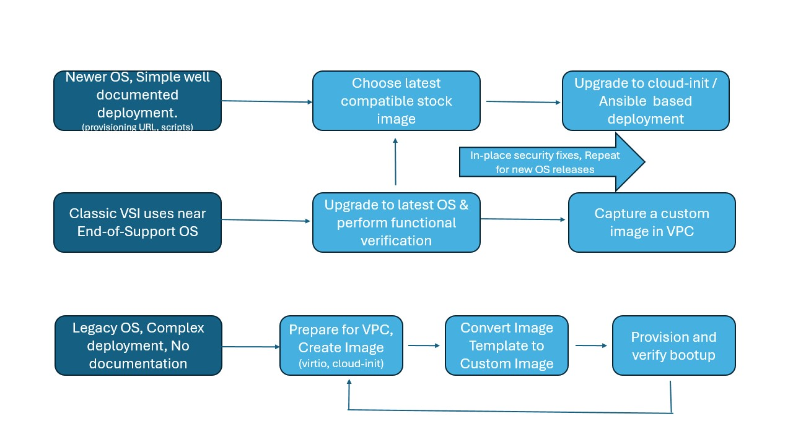

---

copyright:
  years: 2026, 2026
lastupdated: "2026-04-02"

keywords: VSI, Classic Infrastructure, Migration

subcollection: classic-to-vpc
ai-gen-assist: wca

---

{{site.data.keyword.attribute-definition-list}}

# Overview
{: #overview}

This documentation outlines the process of migrating virtual server instances from a Classic infrastructure to a {{site.data.keyword.vpc_full}} (VPC) in {{site.data.keyword.cloud_full}}. It covers essential steps, including preparing the source and target environments, creating a migration plan, and running the migration by using the {{site.data.keyword.cloud_notm}} CLI or API. The guide also addresses potential issues and best practices for a seamless transition.
{: shortdesc}

## Approaches to migration
{: #migration-approach}

At a high level, you can approach migration in several different ways. The most common approaches include:

* **Lift-and-Shift:** This approach involves moving the application or workload to the cloud with minimal changes, essentially lifting it from its current environment and shifting it to the new one.

* **Rebuild-System**: In this method, the application or workload is rebuilt in the target cloud environment, allowing for necessary updates, optimizations, and customizations during the rebuild process.

* **Replatform**: This approach involves modifying the application or workload to take advantage of cloud environment services, while still maintaining the original architecture.

* **Rearchitect**: In this strategy, the application or workload is redesigned for the cloud, often by using microservices, containers, and serverless architectures to maximize scalability, agility, and efficiency.

The choice of approach hinges on various factors, including migration objectives, available time, required effort, and associated costs.

### Recommended approach
{: #recommended-approach}

To begin migrating your classic virtual server instances efficiently, rebuild your system on {{site.data.keyword.vpc_short}}. With this approach, you can move to the latest supported operating system and take advantage of updated security fixes. It also helps you to adjust your continuous delivery pipelines to redeploy the application on new {{site.data.keyword.vpc_short}} instances. This approach is often the most efficient and cost-effective way to migrate, as you can optimize your application for the cloud environment and minimize downtime and disruption.

{: caption="Diagram depicting the different approaches to migrating virtual servers" caption-side="bottom"}
